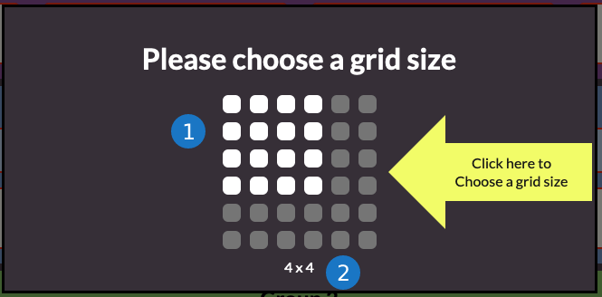

<!-- rewrite this guide to be for the connections game -->

# Creator Guide

## Overview

The Connections Game challenges students to correctly group words that have a relationship in some way.
Students will interact with a grid of words, aiming to correctly connect the words that belong together under
the given descriptions that are revealed on a correct selection. You can provide optional feedback
for incorrect connections at the score screen if desired.

## Details

1. Widget title
2. Show feedback for incorrect answers on score screen
3. Lives/Attempts input
4. Grid size. A grid size of X by Y means that there will be X amount of words per group, and Y number of groups
5. Description input. This is description is what describes the relationship between the words. You can not have duplicate descriptions.
6. Word inputs. You can put multiple words in a single input such as a phrase like "I'm loving it". You can not have duplicate inputs.
7. Duplicate question error text. If you have a duplicate question, it will be shown under the word.
   Similary, duplicate description error text will be shown if you have a duplicate description.

Upon initializing the creator, you will be prompted to provide a title for your widget as well as a grid size. After that, you can start adding words
to the grid.

Remember to set how many lives the player will have in the Lives input(3). By default the player will have only one life if there is no input.
A good rule of thumb for choosing how many lives the player should have is that they should have at minimum the biggest number out of the X by Y grid.

    

The default grid size is a 4 by 4 grid. That means that there will be 4 words per group and 4 groups, and usually they would have 4 lives.
When prompted to choose the grid size, you can hover your mouse over the squares to pick a grid size of X by Y dimensions(1).
You will be able to visually confirm you dimension selection at the bottom(2). You can change the grid size at any time and the previous words you had will be saved.

Once you have decided on a grid size and filled out all input fields, you can click the save draft button to save your widget. Previewing it will allow you
preview the game functionality as well as the scoring. If you have any invalid input fields and attempt to save a widget, the input fields will flash red indicating
which fields you need to complete or fix.
